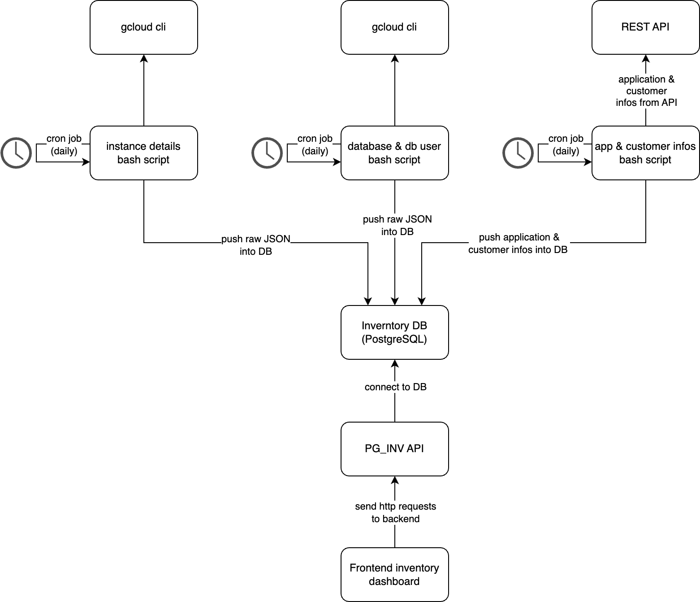

# PG_INV

The PG_INV application is a contained service consisting of multiple parts for aggregating and displaying Instance and customer information for the DB-Administration-Service for CloudSQL based on Postgres. The application landscape consists of a data loading, database, backend and frontend part. Data is fetched once a day. This service therefore does not represent information in real-time.

**Table of contents**

- Architecture
- Folder Structure
- Administration Guide
- Developer Guide

## Architecture

## Folder Structure

- **dashboard:** The dashboard folder contains all source code for the frontend, as well as the API-backend that connects to the database and provides endpoints for the frontend to fetch the data. The frontend, as well as the API part, is written in TypeScript. Next.js with React is used as a framework for structuring the application.
- **database:** The database folder contains all database scripts for creating the schema, as well as the trigger scripts used to transform all JSON inputs from the data_loading into relational table entries.
- **data_loading:** The data_loading folder contains all scripts used to fetch the needed information from the necessary data sources. The goal is to gather general PostgreSQL instance information, as well as which databases and users are present on these instances. This information is then enriched by customer details fetched from the Commerzbank internal Software Product API provided by the Developer Portal. All scripts are triggered once a day (default 23:00) by a cronjob to gather the latest status.
- **docs:** The docs folder contains further documentation as well as images needed by the documentation.
- **other_scripts:** The *other_scripts* folder contains development related files and scripts. These scripts help to set up a development environment in the cloud and manage versioning.

## Administration Guide

The documentation on how to administrate the pg_inv application is split into two sections. General information for administrators and a description of the pg_inv.sh CLI. The pg_inv CLI should be the main interaction point for an administrator to manage the pg_inv application landscape.

General information for administrators can be found at the following page:
[Admin Guide](./docs/admin_guide.md)

Detailed information on how to use the CLI can be found at the following page: [How to use the pg_inv cli](./docs/how_to_use_pg_inv_cli.md)

## Developer Guide

If you want to develop on this application, you can use one of the following Links to learn more about the development process.

- [Develop on the Dashboard (Frontend & Backend)](./dashboard/README.md)
- [Develop on the Data Loading](./data_loading/README.md)
- [Develop on the Database](./database/README.md)